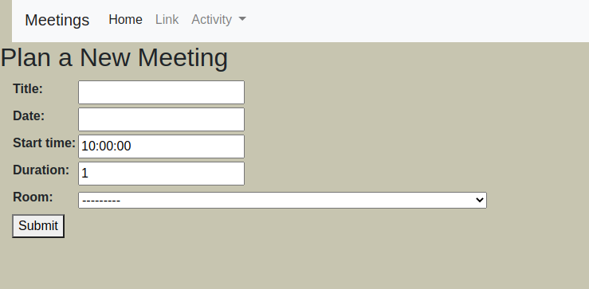
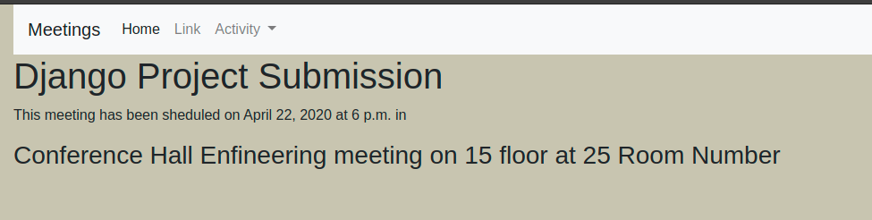

# Meeting Planner

- Meeting Planner is a web app which are build in the Django web app framework.
- Django is a Web app framework of Python for managing Back-End of websites. 
- I used Sql-Lite Database for this because it is very light weight Database and do not required any authentication for connecting.  

- This Application is used to add your Upcoming meeting and their details by this you easily get yours Meeting Details like time, date, location, or other meeting details.  

## How to get this ?

First make sure you have installed git and python3 in your system.

Then run following command to to clone this project in your system

```bash
git clone https://github.com/pradhyumvyas/meeting_planner.git
```

Then open this folder in your system run following command
```bash
python3 manage.py runserver
```

For window user
```bash
python manage.py runserver
```

## Design of Project

In the home page you have seen your all upcoming meetings like 


In the Activity feature of Nav Bar are content following features
- Add Meeting
- View Meeting
- View Available Rooms
- Remove Meeting 

## How to Add Meeting

- First go to the Activity button on the Nav Bar
- Then Click on Add Meeting 
- Fill details and sumbit



## View Meeting

Click on a meeting name on the home page and you get the details of yours meeting

